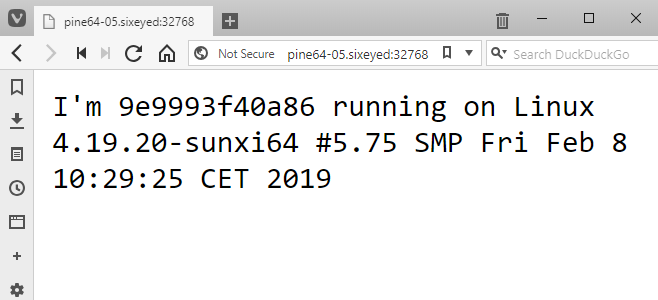

# whoami-dotnet

.NET Core 3.0 app running on ARM 64.

```
docker container run -d -P sixeyed/whoami-dotnet:arm64
```

On a [Pine64](https://www.pine64.org/?product=pine-a64-lts) I get output like this:



And on an [AWS A1 instance](https://aws.amazon.com/ec2/instance-types/a1/) I get this:

